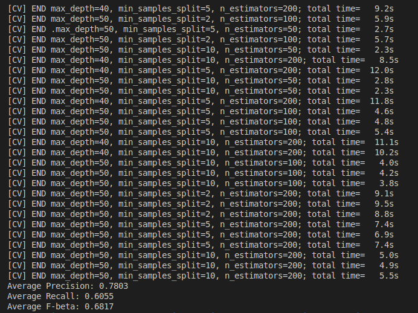

# Model Card

For additional information see the Model Card paper: https://arxiv.org/pdf/1810.03993.pdf

## Model Details
Model version: 1.0
Model date: 26/08/2024
## Intended Use
The machine learning model using for predict the output salary on census data. There are two classes about >50k and <=50k.
## Training Data
The data in data folder with name "census.csv". I have used k-fold cross validation to training model with 5 folder.
## Evaluation Data
Using confusion matrix to evaluate the data test.
## Metrics
The out of performance model archived: (screenshots/output_training.png)

## Ethical Considerations
- The model should be evaluated for biases in predictions such as sex, nationality,...
## Caveats and Recommendations
- Data is very important. So if i have too much time, i will enhance data processing and data cleaning to increase data quality
